  
  
<em>Full-stack developer based in Chengdu, China.</em>

## About Me

I'm a developer who enjoys building reliable backend systems and shipping them with solid DevOps practices. I care about clean code, observability, and picking the right tool for the job.

- Backend services and APIs
- Containers, CI/CD, and cloud-native tooling
- Relational and document data stores

## Connect

## Tech Stack

### Languages

### DevOps & Tools

### Data & Search

## GitHub Stats

  
  
   
  

## Activity

  

---

  
<em>Thanks for stopping by — feel free to reach out!</em>

  

